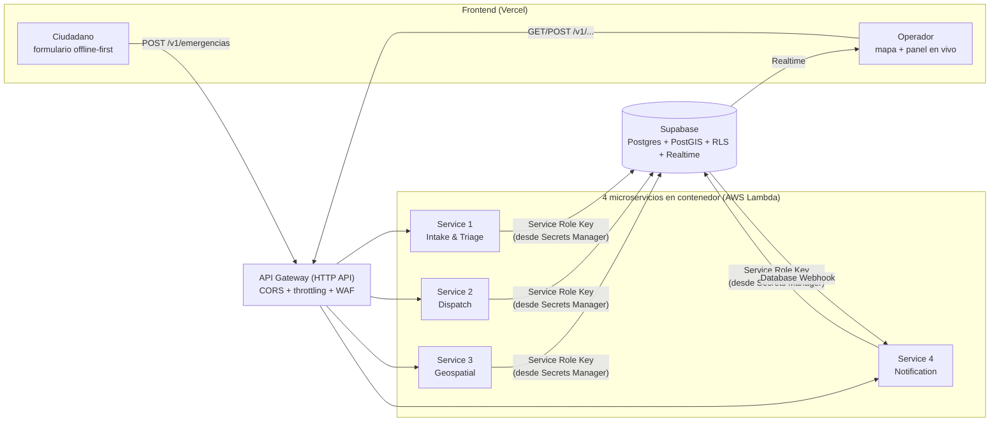

# Resumen general del proyecto — Parcial 1: Arquitectura de Microservicios Serverless Resiliente para Gestión de Emergencias

Este documento resume **todo lo construido** (Fases 1 a 4), explica **por qué** se tomó cada
decisión, lo conecta con la rúbrica de evaluación, y detalla **qué falta** para poder entregar
el taller completo — que ya no es código, sino desplegar todo contra cuentas reales de AWS y
Vercel y capturar la evidencia.

Los documentos técnicos detallados de cada fase están en:
[fase1-modelado-dominio.md](fase1-modelado-dominio.md) ·
[fase2-dockerizacion-lambda.md](fase2-dockerizacion-lambda.md) ·
[fase3-gateway-frontend.md](fase3-gateway-frontend.md) ·
[fase4-canary-costos.md](fase4-canary-costos.md)

---

## 1. El problema y la arquitectura general

El enunciado pide un sistema para que ciudadanos reporten emergencias (Búsqueda y Rescate,
Albergue, Suministros, Evaluación de Daños) en Chocó, Pereira, Cali y Manizales, y para que
operadores de organismos de socorro las vean y despachen ayuda en tiempo real — todo con una
arquitectura de **microservicios desacoplados**, no un backend monolítico.

Cada "Fase" del taller corresponde a construir una capa de este diagrama:

| Fase | Capa | Estado |
|---|---|---|
| 1 | Base de datos (Supabase) | ✅ |
| 2 | Los 4 microservicios (Docker + Lambda) | ✅ |
| 3 | API Gateway + Frontend (Vercel) | ✅ |
| 4 | Estrategia de despliegue + Gobernanza de costos | ✅ |

**Importante:** todo lo construido existe como **código en este repositorio y en tu máquina
local** (Supabase corriendo en Docker). Nada está desplegado todavía en una cuenta real de
AWS ni en Vercel — eso requiere que el equipo cree esas cuentas y ejecute los pasos
documentados en cada fase. Lo que queda ya no es "construir", es "desplegar y grabar evidencia"
(sección 7).

---

## 2. Fase 1 — Modelado de Dominio y Base de Datos

**Qué es:** el diseño de las tablas donde vive toda la información, con reglas de seguridad
para que cada usuario solo vea lo que le corresponde.

**Archivos creados:**
- `supabase/migrations/*.sql` (9 archivos, se ejecutan en orden) — definen las tablas, los
  candados de seguridad y dos funciones de lógica de negocio.
- `supabase/seed.sql` — datos de ejemplo (cuadrillas en las 4 ciudades) para poder probar.
- `supabase/config.toml` — configuración del proyecto Supabase (qué esquemas expone la API,
  login anónimo habilitado, etc.).

**Decisiones clave y por qué:**

- **Un "cajón" (schema de Postgres) por microservicio** (`intake`, `dispatch`, `geospatial`,
  `notification`), en vez de una tabla gigante compartida. Esto hace real el
  "desacoplamiento" que pide la rúbrica: cada microservicio es dueño de sus propias tablas.
- **Row Level Security (RLS):** reglas que la base de datos **obliga** a cumplir — un
  ciudadano solo ve sus propias solicitudes; un operador solo las de su ciudad asignada;
  nadie puede saltárselo ni siquiera con un bug en el código del frontend.
- **PostGIS** (extensión geoespacial de Postgres): permite guardar coordenadas GPS y calcular
  distancias/radios — necesario para "asignar la cuadrilla más cercana" y "agrupar reportes
  por zona caliente".
- **Una función SQL para asignar cuadrillas** (`dispatch.asignar_cuadrilla_cercana`) que evita
  que dos operadores le asignen la misma cuadrilla al mismo tiempo bajo tráfico alto — ataca
  directamente el problema de "picos masivos de tráfico concurrente" que describe el enunciado.
- **Deduplicación automática:** si el mismo ciudadano manda el mismo reporte dos veces (típico
  cuando hay mala señal y la app reintenta), la base de datos lo detecta y lo marca como
  duplicado en vez de crear una emergencia falsa.

**Con qué de la rúbrica cumple:** *Arquitectura de Microservicios y Dominio* (20%) y parte de
*Frontend Vercel y Supabase — Persistencia* (15%).

---

## 3. Fase 2 — Dockerización y Microservicios Serverless

**Qué es:** el código de los 4 microservicios, empaquetado en Docker para correr en AWS Lambda,
con un sistema para leer contraseñas/configuración sin escribirlas en el código.

**Archivos creados:**
- `services/_shared/` — código común de infraestructura (leer secretos, conectar a Supabase,
  formatear respuestas, logs) que **no** es lógica de negocio — cada servicio lo copia dentro
  de su propia imagen al construirse, así ninguno depende de un paquete compartido en tiempo
  de ejecución (siguen siendo 4 imágenes 100% independientes).
- `services/intake-triage/`, `services/dispatch/`, `services/geospatial/`,
  `services/notification/` — cada uno con su `Dockerfile`, su `package.json` y su código
  (`src/handler.ts`).
- `services/build-and-push.sh` — script que construye y sube las 4 imágenes a Amazon ECR.
- `infra/iam/*.json` — permisos mínimos de AWS que necesita cada función (política de "mínimo
  privilegio": cada Lambda solo puede leer *sus propios* secretos, ninguna puede tocar los de
  las demás).
- `infra/scripts/bootstrap-config.sh` — crea esos secretos/parámetros en tu cuenta AWS.

**Decisiones clave y por qué:**

- **Docker multi-stage:** el `Dockerfile` compila el código en una "caja temporal" (con
  herramientas pesadas) y copia solo el resultado final a la caja que de verdad se sube —
  imagen final más liviana. Es literalmente lo que pide la rúbrica ("multi-stage builds,
  imágenes ligeras").
- **Nunca `.env` con contraseñas:** cada Lambda, al arrancar, le pregunta a **AWS Systems
  Manager Parameter Store / Secrets Manager** cuál es la configuración/contraseña del momento,
  en vez de tenerla escrita en el código. Así, aunque el repositorio de GitHub sea público,
  nadie ve una credencial real.
- **4 servicios separados, no 1 backend grande:** cada uno tiene su propio `package.json`,
  su propio `Dockerfile`, su propio ciclo de vida — se puede reconstruir y redesplegar uno
  sin tocar los otros 3.

**Con qué de la rúbrica cumple:** *Dockerización y Serverless Lambda* (20%) completo, y la
mitad de *API Gateway y Gestión de Secretos* (15%) — la parte de "cero variables de entorno
estáticas / IAM de mínimo privilegio".

**Validación realizada:** como este entorno no tenía Docker en ese momento, se instalaron las
dependencias reales de los 4 servicios y se corrió el compilador de TypeScript
(`tsc --noEmit`) para confirmar que el código compila sin errores. **Falta**: construir las
imágenes de verdad con `docker build` y subirlas a tu cuenta AWS (el script ya está listo).

---

## 4. Fase 3 — API Gateway, Enrutamiento y Frontend en Vercel

**Qué es:** la "puerta de entrada" única al sistema (API Gateway) y la página web que la gente
usa de verdad (frontend).

**Archivos creados:**
- `infra/template.yaml` — define el API Gateway: qué rutas existen (ej. `POST /v1/emergencias`),
  a qué Lambda va cada una, y las reglas de seguridad (CORS + límite de solicitudes por IP).
- `frontend/` — aplicación completa en React (Vite): pantalla de login, formulario de
  ciudadano, panel de operador con mapa.
- `services/_shared/auth.ts` (+ ajustes en los handlers) — verificación de identidad real
  entre el frontend y los microservicios.

**Decisiones clave y por qué:**

- **API Gateway como único punto de entrada**, con CORS restringido solo al dominio de Vercel
  (no cualquier página web puede llamarlo) y un límite de solicitudes por IP vía **AWS WAF**
  (si alguien manda demasiadas solicitudes muy rápido, se bloquea — mitiga ataques de
  denegación de servicio, tal como pide el enunciado).
- **Vite + React en vez de Next.js:** para una app de 2 pantallas, un bundle más liviano y
  arranque más rápido — más alineado con "tiempos de carga mínimos en redes degradadas"
  (una víctima reportando desde un celular con mala señal, que es el escenario real del taller).
- **Login anónimo para ciudadanos:** en medio de una emergencia no es razonable pedir que
  alguien se registre con contraseña antes de pedir ayuda.
- **Formulario offline-first:** si el reporte no se puede enviar (sin señal), se guarda en el
  celular y se reintenta solo cuando vuelve la conexión — el reporte nunca se pierde.
- **Mapa del operador cargado aparte (code-splitting):** la librería del mapa (Leaflet) solo la
  descarga el operador, no el ciudadano — así el formulario (usado en la peor conectividad) pesa
  menos.
- **Verificación de identidad real (JWT) entre frontend y backend:** al principio, el backend
  confiaba en que el frontend dijera honestamente "este reporte es de este usuario". Se corrigió
  para que cada Lambda verifique el token de sesión real antes de aceptar cualquier acción — así
  nadie puede reportar una emergencia ni despachar una cuadrilla haciéndose pasar por otra persona.

**Con qué de la rúbrica cumple:** la otra mitad de *API Gateway y Gestión de Secretos* (15%)
— rutas, CORS, throttling — y *Frontend Vercel y Supabase* (15%) — interfaz diferenciada
ciudadano/operador, tiempo real, integración con Supabase.

### Depuración realizada (misma sesión)

Al probar el frontend apareció una pantalla en blanco. Causas y solución:

1. Abrir `frontend/index.html` haciendo doble clic **nunca funciona** (es una app de Vite,
   necesita el servidor de desarrollo `npm run dev` para transformar el código).
2. Faltaban las variables `VITE_SUPABASE_URL` / `VITE_SUPABASE_ANON_KEY` — se creó
   `frontend/.env.local` (no se sube a git) apuntando a una instancia de Supabase levantada
   **localmente con Docker** (`npx supabase start`), que ya aplicó todas las migraciones de
   la Fase 1 automáticamente.
3. Se activó el login anónimo (`enable_anonymous_sign_ins`) en `supabase/config.toml`.
4. Se mejoró `frontend/src/main.tsx` para que, si falta configuración, la página muestre un
   mensaje explicando qué hacer, en vez de quedar en blanco sin ninguna pista.
5. Se probó el flujo completo en un navegador real (login anónimo → creación de perfil →
   formulario) y respondió correctamente.

**Validación realizada:** build de producción real (`npm run build`) exitoso, con el
code-splitting confirmado. **Falta**: desplegar el API Gateway de verdad en AWS (`sam deploy`)
y el frontend en Vercel — ambos documentados paso a paso en `fase3-gateway-frontend.md`.

---

## 5. Fase 4 — Despliegue Progresivo (Canary) y Gobernanza de Costos

**Qué es:** la estrategia para publicar una versión nueva de un microservicio sin arriesgar
todo el tráfico de una vez, más un presupuesto que avisa antes de que la cuenta de AWS se
salga de control.

**Archivos creados/editados:**
- `infra/template.yaml` (extendido) — cada una de las 4 funciones ahora tiene
  `AutoPublishAlias` + `DeploymentPreference` (Canary), y se agregaron 9 alarmas de CloudWatch
  (errores + latencia por servicio, más una compartida de 5xx del API Gateway).
- `services/_shared/chaos.ts` (+ conectado en `http.ts`) — interruptor de fallas sintéticas
  para poder demostrar el rollback de forma controlada y repetible.
- `infra/budget.yaml` — presupuesto mensual en AWS Budgets con 2 alertas por correo.

**Decisión tomada:** Opción A (Canary con CodeDeploy + Lambda Aliases), no Feature Flags —
ver el porqué en `fase4-canary-costos.md`, sección "Por qué Canary".

**Decisiones clave y por qué:**

- **`Canary10Percent5Minutes`:** cada despliegue nuevo recibe solo el 10% del tráfico real
  durante 5 minutos antes de pasar al 100% — así un bug en una versión nueva afecta como mucho
  a 1 de cada 10 ciudadanos, no a todos.
- **3 alarmas por servicio (errores, latencia, 5xx compartida):** si cualquiera se activa
  durante esos 5 minutos, AWS revierte solo al 100% de la versión anterior — sin que nadie
  tenga que darse cuenta y actuar manualmente a las 3 AM durante una emergencia real.
- **Umbral de latencia distinto para Geospatial (5000ms vs. 1500ms):** ese servicio hace un
  cálculo pesado (agrupar puntos en el mapa) que naturalmente tarda más — usar el mismo
  umbral que los demás dispararía falsas alarmas todo el tiempo.
- **El interruptor `CHAOS_ERROR_RATE`:** para *demostrar* el rollback automático hay que ver
  una versión fallando de verdad. En vez de romper el código a propósito cada vez que se
  graba el video, se agregó un parámetro (0-100%) que hace que esa fracción de solicitudes
  falle intencionalmente — se sube para grabar la demo, se vuelve a poner en 0 después.
- **`infra/budget.yaml` separado de `template.yaml`:** el presupuesto es una regla de toda la
  cuenta de AWS, no de esta API en particular — se despliega una sola vez, no cada vez que se
  actualiza el backend.

**Con qué de la rúbrica cumple:** *Estrategia de Despliegue (Canary/Feature Flags)* (20%) y
*Gobernanza de Costos y Documentación* (10%, la parte de Budgets — los diagramas C4 y el video
siguen pendientes, ver sección 7).

**Validación realizada:** se sincronizó `chaos.ts` en los 4 servicios y se corrió
`tsc --noEmit` en los 4 (compilan sin errores); la sintaxis de las alarmas de CloudWatch y del
presupuesto se revisó a mano contra la documentación de CloudFormation. **Falta**: ejecutar un
`sam deploy` real y observar el rollback en la consola de AWS — no se pudo probar aquí por no
tener credenciales de AWS en este entorno. El runbook exacto para hacerlo (y para qué mirar en
la consola) está en `fase4-canary-costos.md`.

---

## 6. Estado final frente a la rúbrica

| Criterio | Peso | Estado |
|---|---|---|
| Arquitectura de Microservicios y Dominio | 20% | ✅ Construido (Fase 1) |
| Dockerización y Serverless Lambda | 20% | ✅ Construido (Fase 2) — falta build/push real a AWS |
| API Gateway y Gestión de Secretos | 15% | ✅ Construido (Fase 2+3) — falta despliegue real |
| Frontend Vercel y Supabase (Persistencia) | 15% | ✅ Construido (Fase 3) — falta publicar en Vercel |
| Estrategia de Despliegue (Canary) | 20% | ✅ Construido (Fase 4) — falta ejecutarlo y grabarlo |
| Gobernanza de Costos y Documentación | 10% | 🟡 Budgets construido — faltan C4 + video |

**Todo el código está listo. Lo que queda es 100% ejecución**: crear las cuentas reales,
correr los comandos ya documentados, y capturar la evidencia (capturas de pantalla, video).

---

## 7. Lo que falta: desplegar de verdad y capturar evidencia

Ya no queda código por escribir para cumplir la rúbrica — lo que falta es **ejecutar** lo ya
construido contra cuentas reales y documentar esa ejecución. En orden:

1. **Crear las cuentas** (si no existen): AWS (Free Tier) y Vercel.
2. **Fase 1 remoto**: crear el proyecto en supabase.com, `supabase link` + `supabase db push`
   (`fase1-modelado-dominio.md`).
3. **Fase 2**: `services/build-and-push.sh` (sube las 4 imágenes a ECR) + crear los roles IAM
   de `infra/iam/*.json` + `infra/scripts/bootstrap-config.sh` (secretos) —
   `fase2-dockerizacion-lambda.md`.
4. **Fase 3**: `sam deploy` de `infra/template.yaml` (API Gateway) + conectar el Database
   Webhook de Supabase + publicar `frontend/` en Vercel — `fase3-gateway-frontend.md`.
5. **Fase 4**: ejecutar el runbook de rollback (subir `ChaosErrorRatePercent` y grabar cómo
   CodeDeploy revierte solo) + `aws cloudformation deploy` de `infra/budget.yaml` —
   `fase4-canary-costos.md`.
6. **Entregables finales** (no son código): diagramas C4, capturas de Budgets, la
   grabación del rollback, y el video demostrativo de ≤5 min — checklist completo al final de
   `fase4-canary-costos.md`.

Todos los comandos exactos para cada paso ya están escritos en el documento de su fase
correspondiente — esto es seguir la receta, no diseñar nada nuevo.
